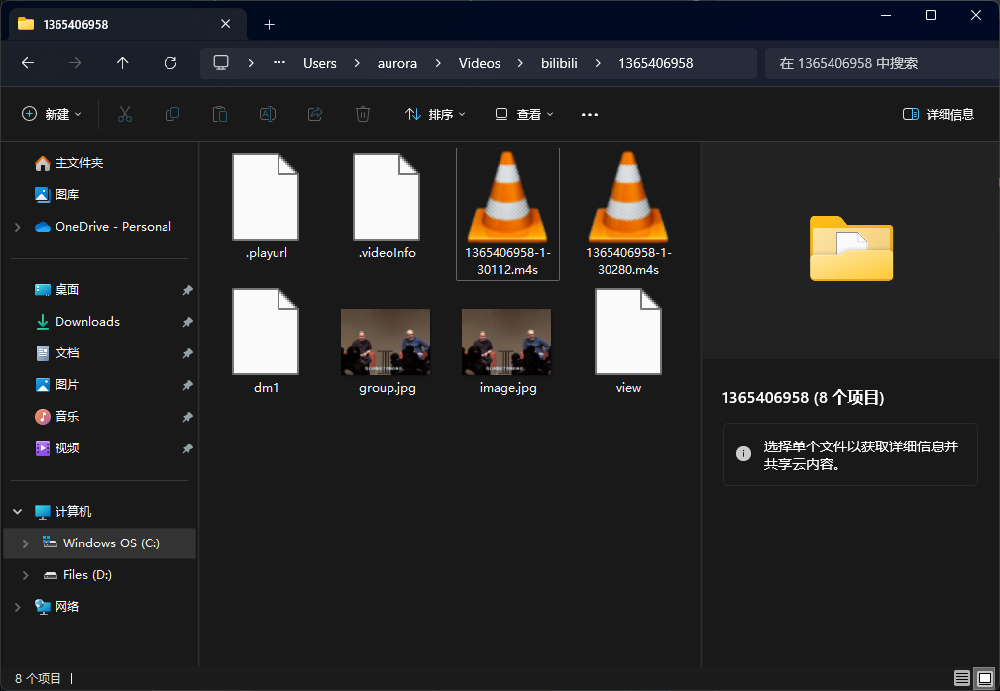
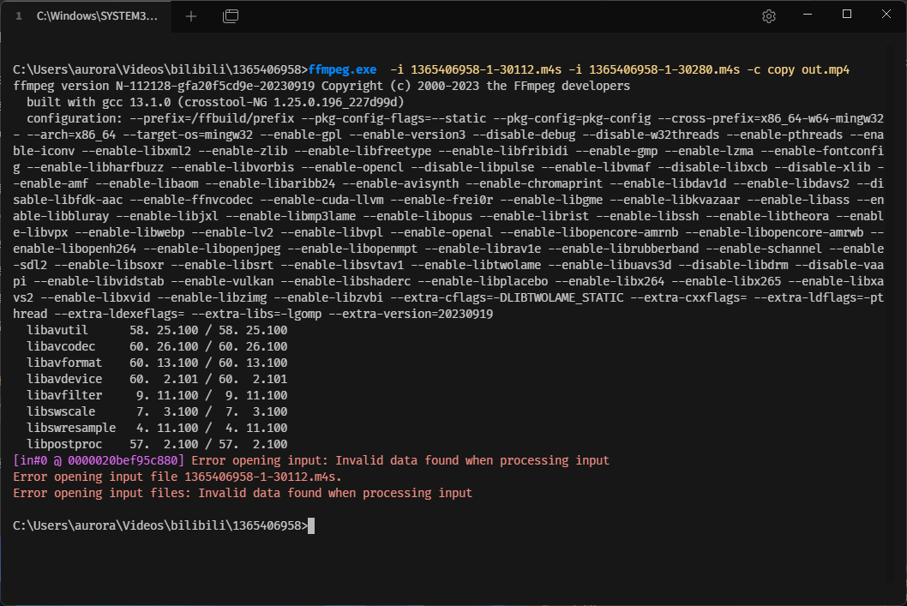
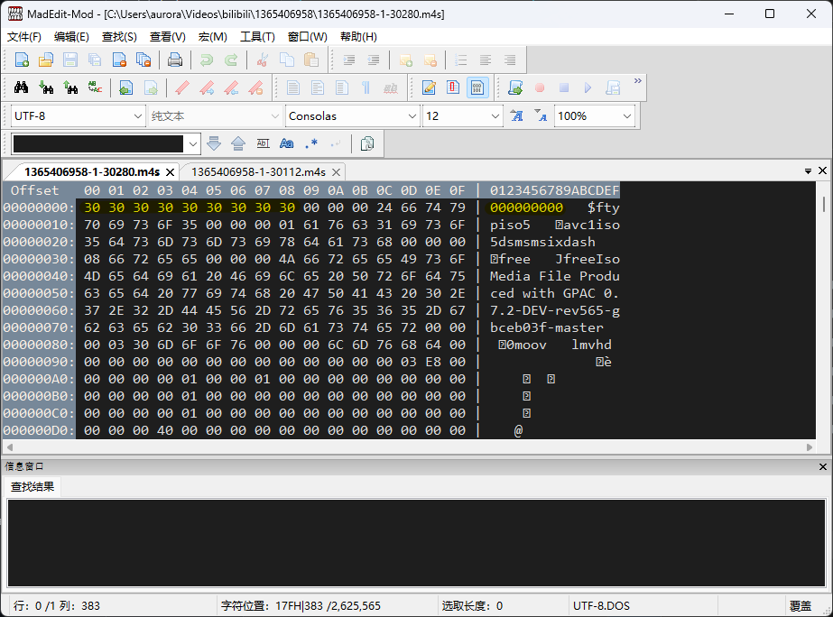
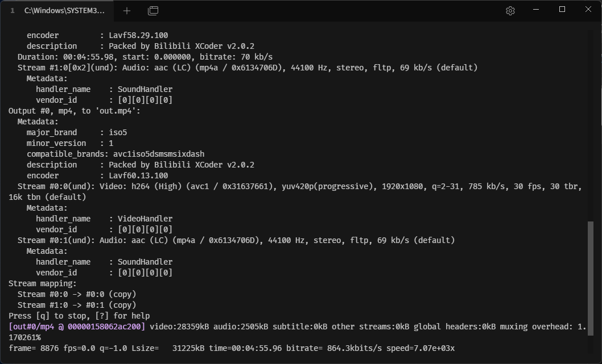
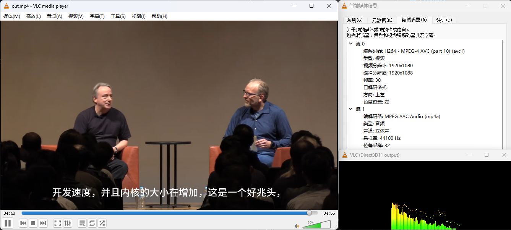

# bilivdtool

A handy tool designed to decode Bilibili's videos and seamlessly merge both video and audio streams.

## Features

- Decode the downloaded video from bilibili.

- Merge the video part and the audio part.

## Configuration

"This tool's video merge functionality is based on [FFmpeg](https://ffmpeg.org). So, if you need to install FFmpeg on your operating system, you can download it from the [official site](https://ffmpeg.org/download.html).

After installing FFmpeg, please make sure to add its path to the system's PATH variable.

Alternatively, you can place the FFmpeg binary file in the same folder as the `bilivdtool`."

## Usage

```shell
bilivdtool -v [video_path] -a [audio_path] -o [output_path]
```

## Build

```shell
git clone https://github.com/aURORA-JC/bilivdtool.git
cd ./bilivdtool
make
```

## About

After downloading the video from Bilibili using either the official client or web scripts, it becomes apparent that the video stream and the audio stream are stored in separate files.



FFmpeg serves as a fitting tool to merge these two parts into a single video file. However, when utilizing FFmpeg directly, an error may occur.



To address this issue, it's necessary to inspect the file's hexadecimal representation.




It becomes evident that the highlighted portion at the start of the files, indicated in yellow, is padded with '0', causing FFmpeg to decode the video file incorrectly.

To resolve this, simply remove the highlighted section and save the files. Subsequently, attempt to merge the files using FFmpeg.



This time, no errors occur, and the file `output.mp4` is successfully generated.

Upon opening it with VLC player, everything functions correctly.



## Contribution

Any positive contribution is welcome.

Please fork the repo and submit PRs.


## License

(C) 2024 Aurora-JC. MIT License